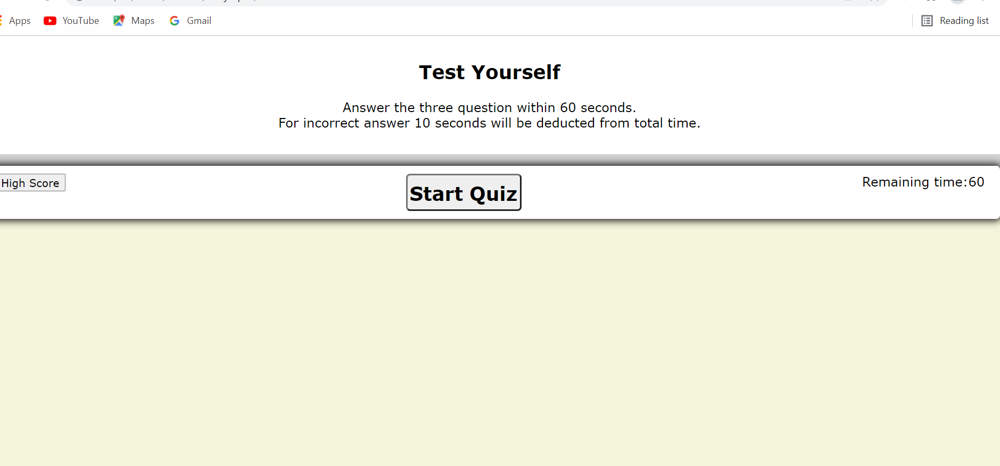

# test-guide
## User Story

As a user
I want to assess the elementary knowledge of the enthusiastic
so that we can make a proper course design.

## Objective:
### To create a multiple-choice questionaire.

## Criteria:
### When an user clicks the start button:

a timer starts and I am presented with a question.
When the user answers a question
then another question is presented.
When a question is answered incorrectly
then time is subtracted from the clock.
When all questions are answered or the timer reaches 0
then the game is over.
When the game is over
then the initial and the score is saved.

## Made with:
### css
### html
### javaScript

## Image of the allication:

## Link to the application:

### Made with love by Chotan Sharma
